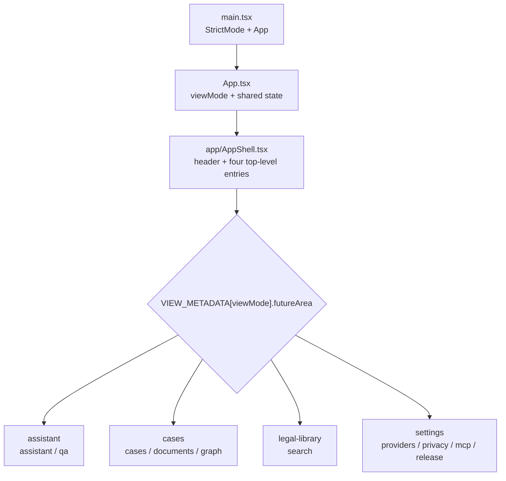
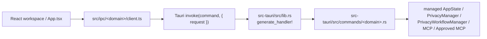
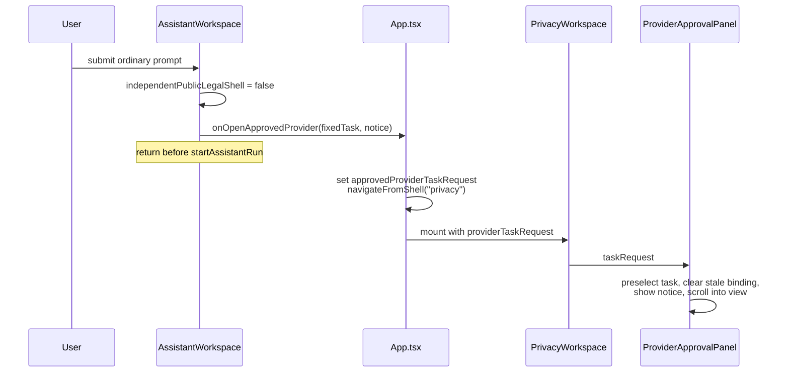
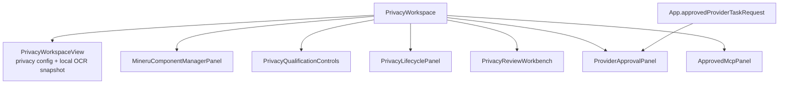
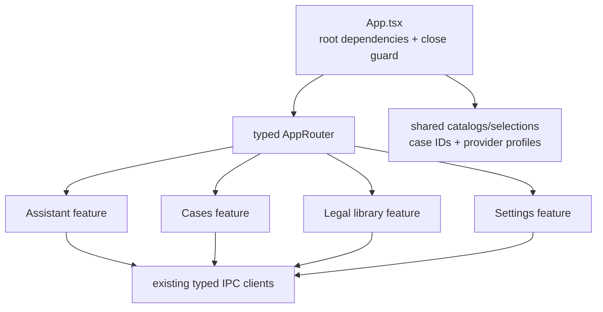

# Phase 1 当前页面与命令依赖图

本文记录 2026-07-29 的实现现状，用于 Phase 2 拆分应用骨架。它描述的是当前依赖和当前错误行为，不是目标产品行为；Phase 1 不借此修改生产代码。

主要核对范围：

- `apps/desktop/src/main.tsx`
- `apps/desktop/src/App.tsx`
- `apps/desktop/src/app/views.ts`
- `apps/desktop/src/app/AppShell.tsx`
- `apps/desktop/src/features/**`
- `apps/desktop/src/ipc/**`
- `apps/desktop/src-tauri/src/lib.rs`
- `apps/desktop/src-tauri/src/commands/**`
- `apps/desktop/src-tauri/src/commands/assistant_run.rs`
- `crates/providers/src/types.rs`

## 1. 当前应用装配与页面组成

### 1.1 根节点与导航模型

`apps/desktop/src/main.tsx` 只负责挂载 `<App />`。当前没有 URL router；`apps/desktop/src/App.tsx` 以本地 `viewMode: ViewMode` 作为唯一页面选择状态。

`apps/desktop/src/app/views.ts` 定义十个兼容视图和四个未来产品区：

| `futureArea` | 顶栏入口 | 该区域当前包含的 `ViewMode` | 页面内二级导航 |
| --- | --- | --- | --- |
| `assistant` | `assistant` | `assistant`, `qa` | 助理工作区、兼容引用问答 |
| `cases` | `cases` | `cases`, `documents`, `graph` | 案件工作台、既有文书模板、确定性图谱 |
| `legal-library` | `search` | `search` | 无 |
| `settings` | `providers` | `providers`, `privacy`, `mcp`, `release` | Provider、隐私与本地处理、MCP、版本与维护 |

`VIEW_NAVIGATION` 只包含 `assistant`、`cases`、`search`、`providers`。`apps/desktop/src/app/AppShell.tsx` 根据当前视图的 `futureArea` 标记顶栏入口为激活，而不是根据入口自身的 `id` 判断。页面标题、眉题和导航文案也全部由 `VIEW_METADATA[activeView]` 提供。



### 1.2 实际渲染归属

`AppShell` 只渲染外壳和 `children`；当前没有独立 `AppRouter`。`App.tsx` 内部的一条条件渲染链承担实际路由。

| `ViewMode` | 当前组件树 | 当前挂载语义 |
| --- | --- | --- |
| `assistant` | 永久存在的 `.assistant-workspace-host` → `features/assistant/AssistantWorkspace.tsx` | 始终挂载，仅用 `hidden={viewMode !== "assistant"}` 隐藏，以保留会话草稿、运行状态和成果编辑状态 |
| `search` | `features/legal-library/LegalLibraryWorkspace.tsx` → `App.tsx` 内联检索、法律/条文列表和详情 | 条件显示；业务状态仍由 `App.tsx` 持有 |
| `qa` | `App.tsx` 内联 `.qa-layout` | 条件显示；表单、候选来源、历史和流状态均由 `App.tsx` 持有 |
| `cases` | `features/cases/CasesWorkspace.tsx` → `App.tsx` 内联案件列表、实体编辑、关联、缺口与结构化提取复核 | 条件显示；`CasesWorkspace` 当前只是带 `aria-busy` 的布局容器 |
| `documents` | lazy `DocumentWorkspace.tsx` | 条件挂载；接收 `selectedCaseProjectId`，引用回跳交给 `App.tsx` |
| `graph` | lazy `GraphWorkspace.tsx` | 条件挂载；图模式和案件/法律选择由 `App.tsx` 提供 |
| `providers` | `features/settings/SettingsWorkspace.tsx mode="providers"` → `App.tsx` 内联 Provider 列表与编辑器 | 条件显示；Provider 状态仍由 `App.tsx` 持有 |
| `privacy` | `SettingsWorkspace mode="privacy"` → lazy `features/privacy/PrivacyWorkspace.tsx` | 条件挂载；离开页面会卸载整个聚合工作区 |
| `mcp` | `SettingsWorkspace mode="mcp"` → lazy `features/mcp/McpWorkspace.tsx` | 条件挂载 |
| `release` | `SettingsWorkspace mode="maintenance"` → lazy `ReleaseWorkspace.tsx` | 条件挂载 |

`LegalLibraryWorkspace`、`CasesWorkspace` 和 `SettingsWorkspace` 目前都是被动布局边界，不拥有路由或业务状态。它们是 Phase 2 可复用的视觉边界，但不能被误认为已经完成了业务拆分。

## 2. `App.tsx` 当前状态所有权

`App.tsx` 同时承担根装配、页面协调器、多个页面的 controller、请求竞态保护和窗口关闭保护。状态可以按以下所有权分组：

| 状态组 | `App.tsx` 当前持有的内容 | 主要消费者或跨页桥 |
| --- | --- | --- |
| 应用壳 | `viewMode`、健康检查、关闭阻断消息 | `AppShell`、全部页面导航 |
| 工作区活动保护 | Assistant/MCP/Privacy 的 dirty、mutation、run refs；Provider/案件/提取的 mutation locks | `navigateFromShell`、`beforeunload`、Tauri `onCloseRequested` |
| Assistant 桥 | 当前会话、外部刷新 key、案件 handoff、Approved Provider task request | `AssistantWorkspace`、法律库、案件页、`PrivacyWorkspace` |
| 法律库 | 查询、案件日期、法律和条文结果、选中法律/条文、版本、关系、详情请求 epoch | 内联 `search`、`GraphWorkspace`、文书引用回跳、Assistant 法源桥 |
| 兼容 QA | 问题表单、Provider、候选上下文、答案、历史、分页、流式请求和取消状态、选中来源 | 内联 `qa`、当前案件选择、Privacy 重定向 |
| Provider 设置 | Profile 列表、选中项、编辑草稿、API key 输入、凭据状态、连接测试结果、mutation lock | 内联 `providers`、Assistant Provider 选择、QA 和提取默认 Provider |
| 案件目录与工作区 | 项目列表、分页、选中项目、完整 `CaseWorkspace`、写入保护、请求 epoch | 内联 `cases`、Assistant 案件上下文、QA、文书、图谱 |
| 案件编辑草稿 | project/file/party/fact/evidence/issue 草稿，法律依据和多种关联选择 | 内联 `cases`、关闭保护 |
| 结构化提取复核 | Provider/文件选择、reducer 状态、pending save 队列、revision、定时器、确认/丢弃/恢复和关闭 flush | 内联 `cases`、窗口关闭保护 |
| 图谱协调 | `graphMode`、法律文档目标、案件节点回跳目标 | `GraphWorkspace`、法律库、案件页 |

三个启动副作用与路由无关，Phase 2 不能因组件条件挂载而无意改变：

1. `App.tsx` 首次挂载时调用 `health_check`，并立即执行一次法律检索。
2. 首次挂载时读取全部 Provider Profile 和凭据状态，并同时初始化 QA、提取和 Provider 编辑选择。
3. 首次挂载时读取案件列表，并自动加载第一个案件工作区。

因此，简单地把这些 state/effect 剪切到仅在对应路由下挂载的组件，会改变预加载、默认选择、Assistant 案件上下文以及跨页关闭保护。

## 3. 前端到 Tauri 的命令边界

### 3.1 公共调用链

前端没有直接调用 Rust service。每个工作区先通过 `apps/desktop/src/ipc/**/client.ts` 形成 typed IPC 请求，再由 `apps/desktop/src-tauri/src/lib.rs` 中唯一的 `tauri::generate_handler!` 注册表分派到 `apps/desktop/src-tauri/src/commands/**`。



`start_assistant_run` 和 `answer_legal_question` 通过 Tauri `Channel` 返回事件；更新下载通过 Tauri event listener 返回进度。其余主要命令使用普通 request/response。

### 3.2 页面与命令族

下表按页面列出当前导入的主要客户端和配套命令族。命令名均与 `src-tauri/src/lib.rs` 的注册名称一致；客户端中存在但未由当前按钮调用的兼容命令在表后另行标出。

| 页面/功能 | 前端客户端与主要命令 | Tauri 注册实现 |
| --- | --- | --- |
| 应用启动 | `ipc/health/client.ts`: `health_check` | `src-tauri/src/lib.rs` 内的 `health_check` |
| Assistant 会话与成果 | `ipc/assistant/client.ts`: `list/create/get/bind/archive_assistant_conversation`、`import_assistant_files`、`delete_assistant_attachment`、`list/get/bind/save/export_assistant_artifact`、`create/reject/apply_assistant_case_change_proposal`、`cancel_assistant_run` | `commands/assistant.rs` |
| Assistant 执行 | `ipc/assistant/client.ts`: `start_assistant_run` | `commands/assistant_run.rs` |
| 法源与 Assistant 桥 | `ipc/assistant/client.ts`: `add_assistant_legal_source`、`propose_assistant_legal_basis` | `commands/assistant.rs` |
| 法律库与候选来源 | `ipc/legal/client.ts`: `search_laws`、`search_articles`、`get_article`、`get_law_document`、`get_law_versions`、`get_law_relations`、`find_legal_answer_candidates`、`list_legal_answer_records`、`cancel_legal_answer` | `commands/legal.rs` |
| 案件目录与实体 | `ipc/case/client.ts`: `list_case_projects`、`get_case_workspace`、`upsert_case_project/file/party/fact/evidence_item/evidence_link/fact_issue_link/legal_issue`、`add_case_legal_basis`、`delete_case_project/entity` | `commands/case.rs` |
| 待复核结构化提取 | `ipc/case/client.ts`: `get/update_pending_structured_case_extraction`、`confirm_structured_case_extraction`、`discard_structured_case_extraction` | `commands/case.rs` |
| 文书 | `ipc/document/client.ts`: `list_document_templates`、`preview_document`、`export_document_pdf` | `commands/document.rs` |
| 图谱 | `ipc/graph/client.ts`: `get_case_graph`、`get_law_graph` | `commands/graph.rs` |
| Provider 设置 | `ipc/provider/client.ts`: `list/upsert/delete_provider_profile`、`get/write/delete_provider_api_key`、`test_provider_connection` | `commands/provider.rs` |
| MCP 设置 | `ipc/mcp/client.ts`: `get/save_mcp_server_config`、`get/start/stop_mcp_server`、`write/delete_mcp_bearer_token` | `commands/mcp.rs` |
| 发布与维护 | `ipc/release/client.ts`、`ipc/release/updater.ts`: `get_version_info`、`export_diagnostic_report`、`check_for_application_update`、`download_install_application_update`、`relaunch_application` | `commands/release.rs`、`commands/updater.rs` |

以下客户端和后端命令仍然存在且已注册，但当前对应提交按钮不再直接调用它们：

- `ipc/legal/client.ts` 暴露 `answer_legal_question`，但 `App.tsx` 的 `submitLegalAnswer` 当前直接调用 Approved Provider 重定向。
- `ipc/case/client.ts` 暴露 `generate_structured_case_extraction`，但 `App.tsx` 的 `runStructuredExtraction` 当前直接调用 Approved Provider 重定向。
- `ipc/case/client.ts` 暴露 `analyze_case_gaps_command`，当前 `App.tsx` 没有导入或调用它。

这一区分很重要：Phase 2 的页面拆分不得把“已注册命令”误当成“当前 UI 正在走的命令路径”。

## 4. 普通 Assistant 到 Privacy 的当前强制重定向

### 4.1 前端主路径

`apps/desktop/src/features/assistant/AssistantWorkspace.tsx` 中：

1. `assistantRunIsIndependentPublicLegal(...)` 无条件返回 `false`。
2. 只要有待发送文本、没有 active run 且 `App.tsx` 提供了 `onOpenApprovedProvider`，`routesToApprovedProvider` 就为真。
3. `startRun` 在调用 `startAssistantRun` 之前执行 `onOpenApprovedProvider(...)` 并立即 `return`。
4. `approvedProviderTaskForAssistantIntent` 把 intent 固定映射为 `case_legal_qa`、`case_organization`、`document_generation`、`relationship_graph` 或 `legal_analysis`；重新生成映射为 `regenerate`。

`apps/desktop/src/App.tsx` 总是向 `AssistantWorkspace` 提供该回调。回调进入 `redirectLegacyEgressToApprovedProvider`，生成递增的 `requestId`，保存 `approvedProviderTaskRequest`，然后调用 `navigateFromShell("privacy")`。



该跳转只完成“打开并预选固定任务”，不会自动批准或发送。`ProviderApprovalPanel` 仍要求加载已脱敏 review、选择 Provider、取得 Provider qualification、填写 reviewer/TTL/instruction、显式确认、签发精确 task binding，最后再调用 `dispatch_approved_provider`。

兼容 QA 的提交和案件结构化提取按钮也复用 `redirectLegacyEgressToApprovedProvider`，分别预选 `case_legal_qa` 与 `structured_extraction`。

### 4.2 后端兜底路径

若绕过前端直接调用 `start_assistant_run`，`apps/desktop/src-tauri/src/commands/assistant_run.rs` 的生产命令会先调用 `authorize_legacy_assistant_public_path`。该函数对每个用户自由文本请求返回：

```text
errorType = approved_provider_required
```

拒绝发生在请求校验、用户数据库读取、Windows 凭据读取、运行持久化和 Provider transport 创建之前。worker 内还有第二次检查以关闭竞态窗口。

`AssistantWorkspace.performRun` 仍保留后端错误兜底：若捕获规范化后的 `AssistantIpcClientError.errorType === "approved_provider_required"`，再次触发同一个 `onOpenApprovedProvider` 跳转。

内部旧执行代码的 `ordinary_chat_request` 还调用 `ChatRequest::unapproved_case_for_rejection`。`crates/providers/src/types.rs` 将它标为 `ChatRequestAuthority::ApprovedCase`，并映射到 `DataClassification::CaseRedactedApproved`。这个 authority 对普通自由文本是错误的；未经过 receipt 准备与授权时，Provider adapter 会 fail closed。生产入口目前更早返回 `approved_provider_required`，所以该错误 authority 通常只在内部测试路径中可见。

## 5. `PrivacyWorkspace` 当前聚合链

`apps/desktop/src/features/privacy/PrivacyWorkspace.tsx` 不是单一“隐私设置页”，而是七个不同职责的同页聚合器。



| 子区域 | 前端 IPC | Tauri 命令模块 |
| --- | --- | --- |
| 配置与 OCR 状态 `PrivacyWorkspaceView` | `ipc/privacy/client.ts`: `get/save_privacy_config`、`get_local_ocr_status`、`discover_local_mineru` | `commands/privacy.rs` |
| MinerU 组件管理 | `ipc/privacy/mineru-component-client.ts`: status、catalog import、offline/download install、rollback、uninstall | `commands/mineru_components.rs` |
| 本地 OCR qualification | `ipc/privacy/client.ts`: trust、network isolation、run/revoke qualification | `commands/privacy.rs` |
| 生命周期、mapping、retention 与 backup | `ipc/privacy/client.ts`: lifecycle status/policy/hold、mapping reveal/revoke/key rotation/destruction、retention sweep、privacy backup；另含 application backup | `commands/privacy_lifecycle.rs`、`commands/application_backup.rs` |
| 人工脱敏复核与风险复核 | `ipc/privacy/client.ts`、`ipc/privacy/risk-client.ts`: prepare/load/delete/approve review、risk apply/undo/redo、safe export | `commands/privacy_workflow.rs`、`commands/privacy_export.rs` |
| Approved Provider | `ipc/privacy/client.ts` + `ipc/provider/client.ts`: latest review、Provider qualification、task approval、dispatch、protected output history | `commands/privacy_workflow.rs`、`commands/privacy_provider.rs`、`commands/provider.rs` |
| Approved MCP | `ipc/privacy/approved-mcp-client.ts`: qualification、review selection、generation publication/revoke、standalone session | `commands/approved_mcp.rs` |

聚合器自己持有：

- `configResponse`、配置草稿、配置操作状态；
- 六个子面板的 activity flags；
- dirty 计算和向 `App.tsx` 回报的 `onDraftDirtyChange`；
- 所有 activity 的合并结果和 `onMutationActivityChange`；
- 子面板之间的互斥 `disabled` 条件。

各面板并不共享同一个 review controller。比如 `PrivacyReviewWorkbench` 管理自己的 `review`，`ProviderApprovalPanel` 又独立调用 `load_latest_privacy_review`。`approvedProviderTaskRequest` 只传给 `ProviderApprovalPanel`，用于预选任务和清除旧 task binding。

当前材料准备也没有案件归属：

```ts
preparePrivacyMaterial({ customTerms: terms })
```

虽然 `ipc/privacy/types.ts` 的 `PreparePrivacyMaterialRequest` 允许 `caseId?: string | null`，`PrivacyReviewWorkbench` 没有接收案件 prop，也没有传 `caseId`。`commands/privacy_workflow.rs` 最终把 `request.case_id`（当前为 `None`）交给 workflow。这是 Phase 3 迁移前必须保留的现状，不应在 Phase 2 骨架拆分中顺手修复。

## 6. Phase 2 安全拆分缝

### 6.1 可先拆出的边界

1. **路由模型与渲染分派**
   保留十个现有 `ViewMode` 作为兼容输入，先从 `app/views.ts` 提取 typed route/area 映射，再建立只做组件分派的 `AppRouter`。不要在同一步改变导航文案、默认视图、二级导航或 URL 行为。

2. **内联页面视图**
   `search`、`qa`、`cases`、`providers` 已有明显 JSX 边界。可以先抽成纯 view component，以 typed props 接收现有状态和 action；第一步仍由原 controller 提供数据，避免同时改变请求时序。

3. **领域 controller/hooks**
   `App.tsx` 的 import 已按 `ipc/legal`、`ipc/case`、`ipc/provider` 分组，可分别建立 legal、case、provider controller。初次迁出时 controller 应在根装配层持续挂载，保留当前 eager load 与跨页共享选择，再决定后续是否按路由延迟加载。

4. **纯函数与常量**
   请求 epoch、案件 dirty 检测、分页、图节点路由、删除确认、关闭决策等纯函数可按领域迁出。`apps/desktop/src/App.state.test.ts` 当前直接从 `./App` 导入大量函数；迁出期间需要同步更新测试或保留临时 re-export，不能静默丢失表征覆盖。

5. **统一工作区活动契约**
   Assistant、MCP、Privacy 已通过 `onDraftDirtyChange` 和 `onMutationActivityChange` 上报。案件、Provider、QA/提取可以采用同一 typed activity contract，让根层只聚合关闭决策，不再读取各领域内部 refs。

6. **窄化跨功能桥**
   应显式建模以下少量事件，而不是让 feature 相互读取状态：

   - `openRoute(route)`
   - `selectCase(projectId)`
   - `handoffCaseToAssistant(projectId)`
   - `openLegalCitation(sourceId/documentId)`
   - `addLegalSourceToConversation(conversationId, sourceId)`
   - `requestApprovedProviderTask(task, notice)`
   - `refreshCase(projectId)` / `refreshAssistantConversation(conversationId)`

   这些事件只传 opaque ID 和必要的 typed route state；不传完整可变工作区对象。

### 6.2 必须保持的装配不变量

- Assistant workspace 继续永久挂载并以 `hidden` 切换，直到有等价的草稿、run 和成果状态持久化方案。
- Privacy、MCP、Document、Graph、Release 当前仍按路由条件挂载；Phase 2 不改变其卸载语义。
- `navigateFromShell` 的 MCP/Privacy dirty 与 mutation 导航保护保持集中生效。
- 根窗口关闭保护继续覆盖案件草稿、Provider 草稿、提取 flush、Assistant run/写入、MCP 和 Privacy。
- Provider 与案件目录仍在根组件挂载后立即开始 eager 初始化，不依赖用户先进入 Provider 或案件页面。
- `selectedCaseProjectId` 仍是 Assistant、QA、Document 和 Graph 的共享选择来源。
- `approvedProviderTaskRequest` 在离开 Privacy 时仍由 `App.tsx` 清除，避免旧任务在下一次进入时重放。
- Phase 2 不重命名 Tauri 命令、不改变 request envelope、不放宽 Provider/Privacy/MCP fail-closed 边界。
- `PrivacyWorkspace` 的七部分聚合和无 `caseId` 材料准备保持现状；职责迁移分别留给 Phase 3 和 Phase 6。

### 6.3 建议的 Phase 2 终点



该终点只改变前端所有权和装配位置：功能仍走现有 IPC client 和同一 Tauri 注册表，当前错误重定向、Privacy 聚合、命令拒绝和安全边界均保持不变，供后续 Phase 3/4/6 分别替换。
